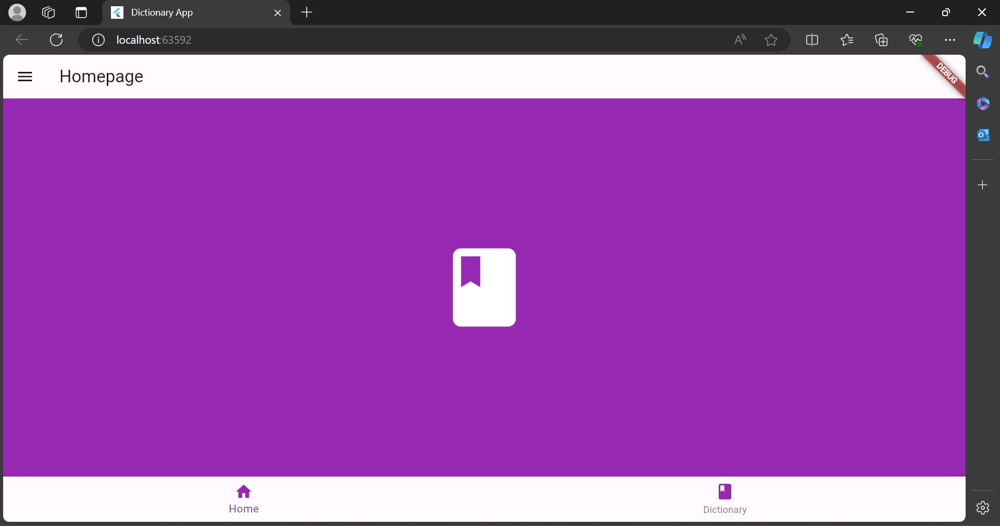
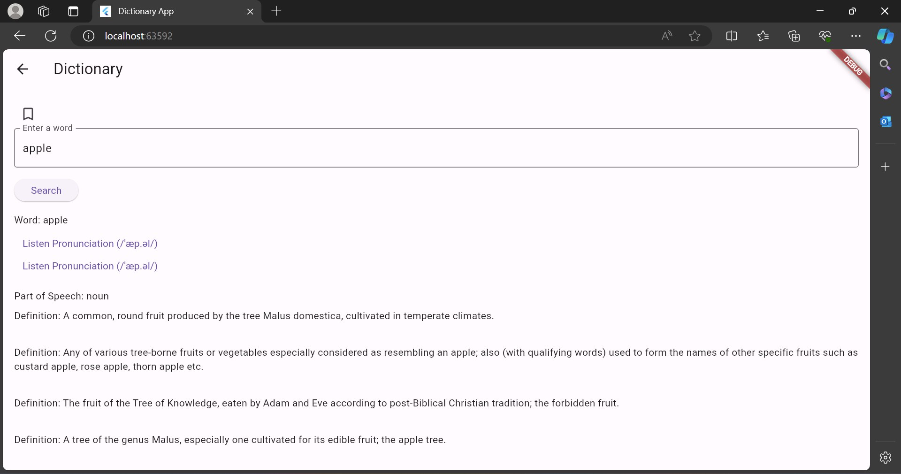
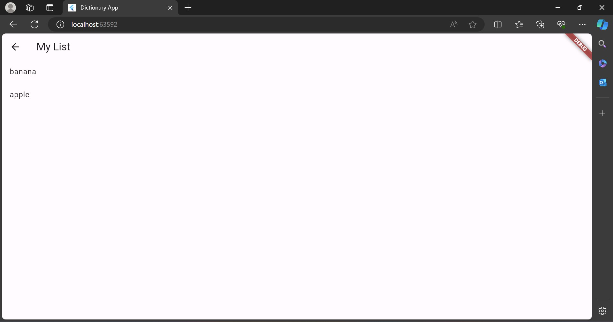
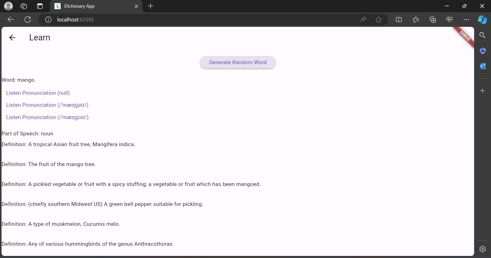
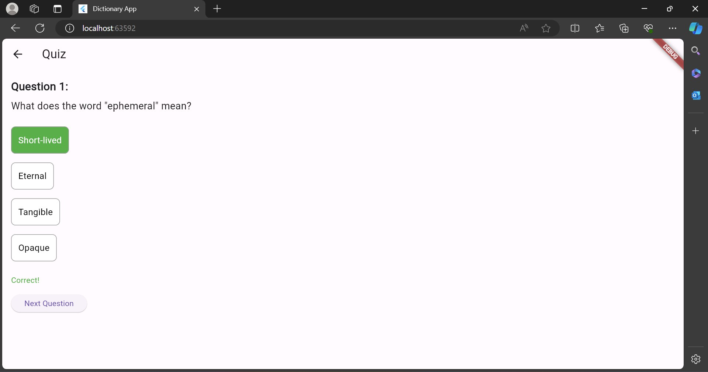
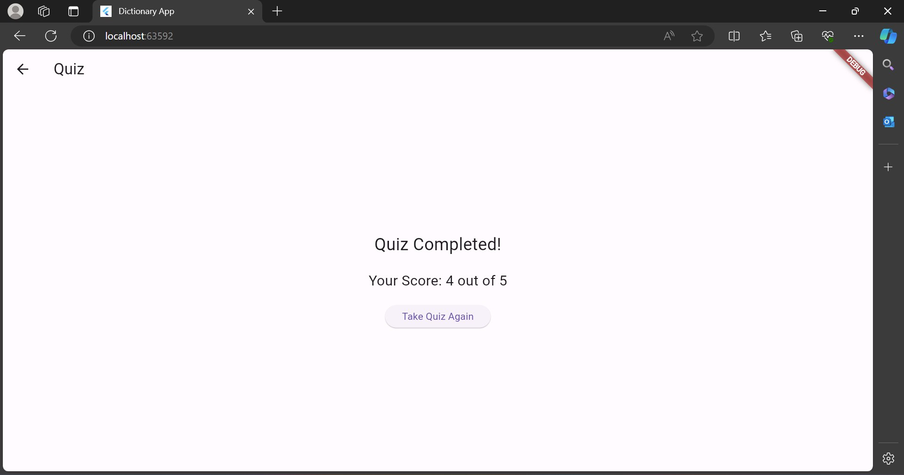

Dictionary App
==============

The Dictionary App is a mobile application built with Flutter that allows users to search for word definitions, listen to pronunciations, and save words to their personal lists for future reference. The app provides a user-friendly interface and essential features for exploring and learning new words.

Features
--------
- Search for Word Definitions: Enter a word in the search bar to retrieve its definition. View the word's part of speech, definition, synonyms, antonyms, and usage examples.
- Listen to Pronunciations: Tap on the "Listen Pronunciation" button to hear the pronunciation of the word.
- Save Words to My List: Save interesting words to your personal list for later review. Access your saved words anytime for quick reference.
- Generate Random Words for Learning: Generate random words to expand your vocabulary and learn new words effortlessly.
- Take Quizzes to Test Your Knowledge: Engage in quizzes to test your understanding of various words and their meanings.

Screenshots
-----------

Installation
------------
1. Install Flutter: Make sure you have Flutter installed on your machine. If not, follow the instructions on the official Flutter website to install Flutter.
2. Clone Repository: Clone this repository to your local machine using the following command:
git clone https://github.com/your/repository.git
3. Navigate to Project Directory: Navigate to the project directory using the following command:
cd dictionary_app
4. Run the App: Run the app using the following command:
flutter run

Dependencies
------------
- http: A Dart library for making HTTP requests.
- shared_preferences: A Flutter plugin for reading and writing simple key-value pairs.
- audioplayers: A Flutter plugin for playing audio files.
- dart:math: Dart's built-in math library for generating random numbers.

Contributing
------------
Contributions are welcome! If you encounter any issues or have suggestions for improvements, please feel free to open an issue or submit a pull request on GitHub.

License
-------
This project is licensed under the MIT License. See the LICENSE file for details.
